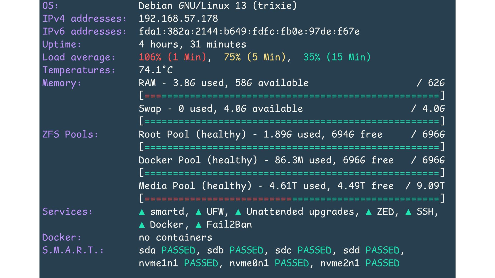

# Fancy MOTD
Fancy, colorful MOTD written in bash. Server status at a glance.

Fork of: https://github.com/bcyran/fancy-motd.git

Adjusted to my needs.



## Usage

### Install

```shell
sudo git clone https://github.com/mietzen/fancy-motd.git /opt/fancy-modtd
sudo rm /etc/update-motd.d/*
sudo rm /etc/motd
sudo ln -s /root/fancy-motd/motd.sh /etc/update-motd.d/10-fancy-modt
```

### Requirements

* [`figlet`](http://www.figlet.org/)
* [`curl`](https://curl.se/)
* [`bc`](https://www.gnu.org/software/bc/)
* [`lm-sensors`](https://github.com/lm-sensors/lm-sensors)
